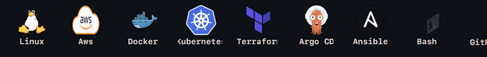

# Hi, I'm Avinasha Shetty 👋

### DevOps Engineer | Cloud Engineer | AWS | Kubernetes | Terraform

I'm a **DevOps Engineer (Fresher)** passionate about cloud infrastructure, automation, and reliable application deployments.

- ☁️ **Cloud & IaC:** AWS | Terraform
- 🐳 **Containers:** Docker | Kubernetes | Helm
- 🔄 **CI/CD & GitOps:** GitHub Actions | Jenkins | Argo CD
- 📊 **Monitoring:** Prometheus | Grafana | CloudWatch
- 🐧 **Scripting:** Linux | Bash
- 💻 **Programming:** Core Java | JavaScript | MERN

  

🚀 Currently building and learning **Cloud, DevOps, Kubernetes, CI/CD & DevSecOps**.

📍 Bengaluru, India

[LinkedIn](https://www.linkedin.com/in/avinashashetty/) • [GitHub](https://github.com/AvinashShetty7)
